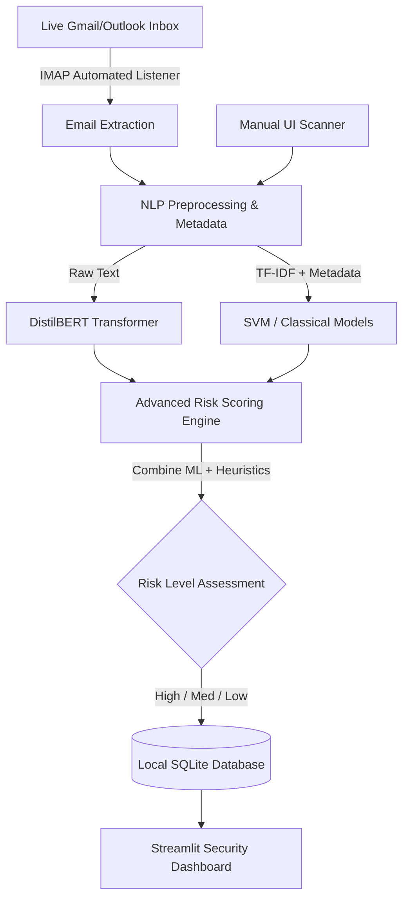

# 🛡️ PhishGuard 2.0: Automated NLP Scam & Phishing Detector
**Final Project Report**

---

## 1. Introduction
Electronic mail remains the primary communication medium for both personal and corporate correspondence, making it the primary vector for cyberattacks. Malicious actors use social engineering to deceive users into revealing sensitive information. 

While baseline machine learning models can classify static text, modern cybersecurity requires active defense. **PhishGuard 2.0** evolves beyond a static text classifier into a **Local Automated Email Threat Detection System**. It continuously monitors a live inbox, automatically extracts incoming emails, analyzes them using NLP and custom heuristics, and logs the calculated threat levels to a live Security Dashboard.

## 2. Problem Statement
The objective of this project is to build an intelligent, automated classifier that predicts malicious intent with minimal user friction. A critical constraint in this domain is the **False Negative Rate (FNR)**. If a phishing email is classified as legitimate (False Negative), it exposes the user to severe security breaches. Therefore, the system must prioritize minimizing False Negatives by employing a multi-layered risk scoring engine while maintaining high overall accuracy.

## 3. Literature Survey
Traditional spam systems rely on static blocklists and rule-based heuristics (e.g., regex matching). These methods struggle against zero-day phishing campaigns that actively alter their vocabulary. 

The integration of **Natural Language Processing (NLP)** introduced dynamic detection. Classical approaches utilize Bag-of-Words or **TF-IDF** to vectorize text, feeding them into algorithms like Support Vector Machines (SVM). More recently, **Contextual NLP** and Transformers (such as Hugging Face's DistilBERT) have revolutionized text classification by understanding the semantic meaning and context of sentences. 

## 4. Methodology & V2 Implementation
The methodology was divided into rigorous scientific training, followed by software engineering for automation:
1. **Data Preparation:** We utilized a balanced dataset of 82,000 emails, processed with a strict 80/20 train/test split.
2. **NLP Preprocessing:** HTML, URLs, and punctuation were stripped, stopwords eliminated using NLTK, and words lemmatized.
3. **Advanced Risk Scoring:** The system calculates a final `Risk Score` (out of 100) by combining the raw Machine Learning probability with heuristic triggers (e.g., if ML predicts phishing *and* the email contains urgency words and URLs, the risk score is aggressively boosted).
4. **Automated IMAP Listener:** A background Python worker securely connects to a live Gmail inbox via App Passwords, fetching unread emails the second they arrive and feeding them to the NLP engine.
5. **Local SQLite Database:** All predictions, metadata indicators, and timestamps are logged instantly to a local SQLite database (`phishguard.db`), entirely bypassing the need for cloud storage.

## 5. Architecture

## 6. Algorithms
The project trained and compared four distinct classification algorithms:
1. **Logistic Regression:** A linear classifier serving as the baseline for TF-IDF performance.
2. **Support Vector Machine (LinearSVC):** Selected for high-dimensional space capabilities, highly suited for sparse TF-IDF matrices. Used as the primary engine for the live email listener.
3. **Random Forest:** An ensemble decision-tree method fed a hybrid feature set: the TF-IDF matrix concatenated with 7 custom metadata features (URL counts, HTML presence, etc.).
4. **DistilBERT:** A Contextual Transformer model utilizing Hugging Face's AutoTokenizer and deep contextual embeddings to classify raw text sequences.

## 7. Experimental Results & Comparison
The models were evaluated against a locked subset of test emails to guarantee a fair comparison. *(Note: DistilBERT was run as a rapid 500-sample prototype for CPU execution efficiency).*

| Model | Accuracy | Precision | Recall | F1-Score | ROC-AUC | False Negative Rate (FNR) |
| :--- | :--- | :--- | :--- | :--- | :--- | :--- |
| **Logistic Regression** | 98.65% | 98.47% | 98.94% | 98.70% | 99.83% | 1.05% |
| **SVM (Linear)** | 98.60% | 98.28% | **99.04%** | 98.66% | **99.86%** | **0.95%** |
| **Random Forest (w/ Metadata)** | 98.55% | **98.56%** | 98.65% | 98.61% | **99.86%** | 1.34% |
| **DistilBERT (Prototype)** | 82.85% | 83.14% | 84.18% | 83.65% | 92.06% | 15.81% |

## 8. Conclusion
The experimental results demonstrate that machine learning is highly effective at identifying phishing vectors. 
* **The SVM architecture emerged as the optimal algorithm**, achieving the lowest False Negative Rate (0.95%). 
* The **Random Forest** successfully proved that structural metadata (like URL counts) provides immense mathematical value alongside textual data, securing the highest overall precision (98.56%).
* Finally, the transition to **PhishGuard 2.0** successfully bridged the gap between theoretical Data Science and applied Cybersecurity. By integrating the models with a live IMAP listener, a custom Risk Scoring engine, and a SQLite Security Dashboard, the project operates as a fully automated, real-world threat detection system.

## 9. Future Scope
* **Full-Scale Transformer Training:** Scaling the DistilBERT model to train on the complete 65,000-email dataset using GPU acceleration to surpass the classical models.
* **Multimodal Detection:** Expanding the architecture to analyze image attachments (e.g., OCR on fake invoices) often found in modern phishing.
* **Native Email Client Plugins:** Porting the IMAP background listener directly into an Outlook Add-in or Chrome Extension for seamless user alerts.
