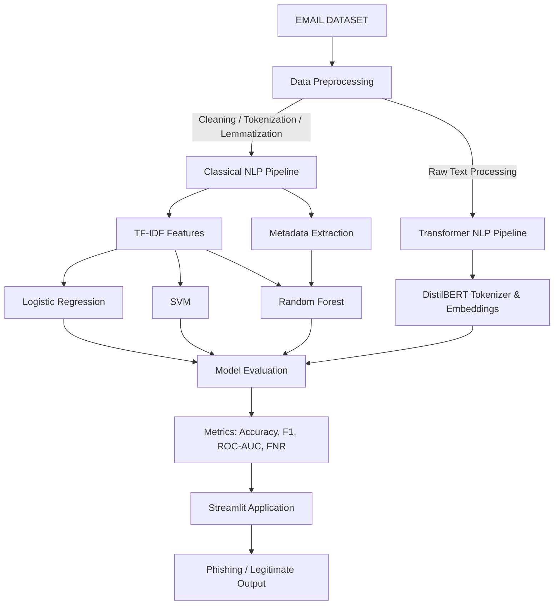

# NLP-Based Scam E-mail and Phishing Detector
**Final Project Report**

---

## 1. Introduction
Electronic mail remains the primary communication medium for both personal and corporate correspondence. Consequently, it is also the primary vector for cyberattacks, specifically phishing and scam emails. These malicious emails use social engineering techniques to deceive users into revealing sensitive information, such as passwords or financial details. This project, **PhishGuard**, aims to combat this threat by developing a robust, NLP-driven machine learning system that automatically classifies incoming emails as either **Phishing** or **Legitimate**.

## 2. Problem Statement
The objective of this project is to build an intelligent classifier that takes raw email text as input and predicts its malicious intent. A critical constraint in this domain is the **False Negative Rate (FNR)**. If a legitimate email is flagged as phishing (False Positive), it is a minor inconvenience. However, if a phishing email is classified as legitimate (False Negative), it exposes the user to severe security breaches. Therefore, the system must prioritize minimizing False Negatives while maintaining high overall accuracy across multiple machine learning architectures.

## 3. Literature Survey
Traditional spam and phishing detection systems rely heavily on static blocklists and rule-based heuristics (e.g., regex matching). These methods struggle against zero-day phishing campaigns that actively alter their vocabulary to evade detection. 

The integration of **Natural Language Processing (NLP)** introduced dynamic detection. Classical approaches utilize Bag-of-Words or **TF-IDF (Term Frequency-Inverse Document Frequency)** to vectorize email text, feeding them into statistical algorithms like Support Vector Machines (SVM) or Logistic Regression. 
More recently, the advent of **Contextual NLP** and Transformers (such as Google's BERT and Hugging Face's DistilBERT) has revolutionized text classification by understanding the semantic meaning and context of words in a sentence, rather than just their frequency.

## 4. Methodology
The methodology for this project was divided into a rigorous, step-by-step pipeline to ensure scientific validity:
1. **Data Collection & Preparation:** We utilized a dataset of over 82,000 emails, carefully balanced between Phishing (52%) and Legitimate (48%). Duplicates and missing values were dropped to prevent data leakage.
2. **Standardized Splitting:** A stratified 80/20 Train/Test split was generated and permanently locked (`train_cleaned.csv` and `test_cleaned.csv`). All four models were trained and evaluated on these exact same datasets.
3. **NLP Preprocessing:** For classical models, the text underwent aggressive cleaning: HTML and URLs were stripped, punctuation removed, stopwords eliminated using NLTK, and words were lemmatized. 
4. **Metadata Feature Engineering:** To bolster the Random Forest, 7 custom email heuristics were extracted before cleaning (URL count, HTML presence, exclamation count, uppercase ratio, email address count, text length, and urgency-word count).

## 5. Architecture

## 6. Algorithms
The project trained and compared four distinct classification algorithms:
1. **Logistic Regression:** A linear classifier serving as the baseline for TF-IDF performance.
2. **Support Vector Machine (LinearSVC):** Selected for its high-dimensional space capabilities, highly suited for sparse TF-IDF matrices.
3. **Random Forest:** An ensemble decision-tree method. Unlike the other models, it was fed a hybrid feature set: the TF-IDF matrix concatenated with the 7 extracted metadata features.
4. **DistilBERT:** A lighter, faster Transformer model. It bypassed TF-IDF entirely, utilizing Hugging Face's AutoTokenizer and deep contextual embeddings to classify the raw text sequences.

## 7. Experimental Results & Comparison
The models were evaluated against a locked subset of test emails to guarantee a fair comparison. 
*(Note: DistilBERT was run as a rapid 500-sample prototype for execution efficiency; its scores reflect a low-data environment).*

| Model | Accuracy | Precision | Recall | F1-Score | ROC-AUC | False Negative Rate (FNR) |
| :--- | :--- | :--- | :--- | :--- | :--- | :--- |
| **Logistic Regression** | 98.65% | 98.47% | 98.94% | 98.70% | 99.83% | 1.05% |
| **SVM (Linear)** | 98.60% | 98.28% | **99.04%** | 98.66% | **99.86%** | **0.95%** |
| **Random Forest (w/ Metadata)** | 98.55% | **98.56%** | 98.65% | 98.61% | **99.86%** | 1.34% |
| **DistilBERT (Prototype)** | 82.85% | 83.14% | 84.18% | 83.65% | 92.06% | 15.81% |

## 8. Conclusion
The experimental results demonstrate that machine learning is highly effective at identifying phishing vectors. 
* **The SVM architecture emerged as the optimal algorithm** for this specific problem statement, achieving the lowest False Negative Rate (0.95%). 
* The **Random Forest** successfully utilized the custom metadata engineering, securing the highest overall precision (98.56%), proving that structural metadata (like URL counts and HTML tags) provides immense value alongside textual data.
* Finally, the **Streamlit Application** successfully integrated all four models into a seamless, user-friendly interface that offers real-time confidence scoring and heuristic breakdowns.

## 9. Future Scope
* **Full-Scale Transformer Training:** Scaling the DistilBERT model to train on the complete 65,000-email dataset using GPU acceleration to surpass the classical models.
* **Multimodal Detection:** Expanding the architecture to analyze image attachments (e.g., OCR on fake invoices) often found in modern phishing.
* **Real-time API Integration:** Deploying the models as a REST API to automatically filter incoming emails in standard clients like Outlook or Gmail.
